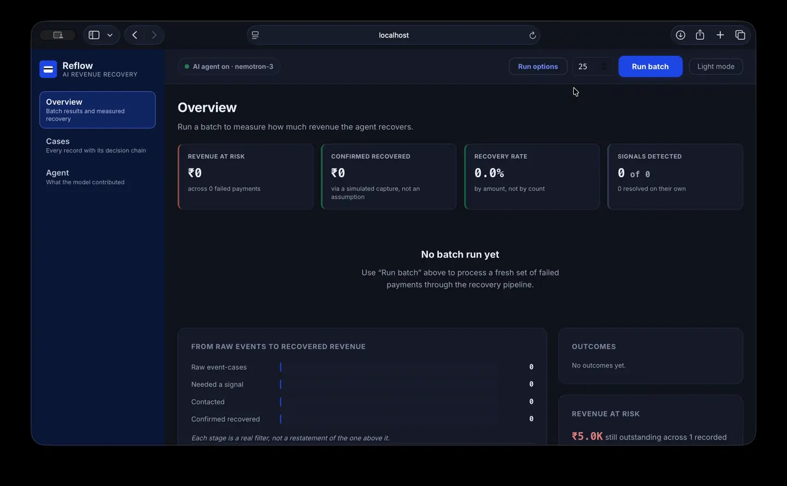

# Reflow

**A bounded revenue-recovery agent for failed payments and overdue receivables.**


Reflow detects revenue at risk, decides what to do about it, and — crucially —
knows when to stop. A deterministic policy engine is the sole authority on
whether money moves. NVIDIA NIM (Nemotron) advises: it may choose between
actions the policy has already authorised, and can never add one, raise a
limit, or overturn a refusal.

> **Nemotron advises within bounds. Policy authorises. The executor acts. The audit log records, and can prove it was not edited.**

- **[docs/PITCH.md](docs/PITCH.md)** — what it does, with measured numbers
- **[docs/ARCHITECTURE.md](docs/ARCHITECTURE.md)** — request path, safety properties, and what enforces each

## Demo



The fastest browser demo is **Run guided demo** on the Overview, which sends one
below-cap insufficient-funds event through the complete pipeline and logs what
each stage decided.

## What works today

Everything runs on synthetic, Razorpay-shaped events by default. The
`SimulatedPaymentExecutor` makes no network calls and reports simulated
captures, so recovery can be measured without touching a gateway. Every result
carries `simulated: true` until a real gateway is actually contacted.

- **Payment failures** — classified, bounded, retried or refused
- **Overdue receivables** — a 72-hour chaser rather than a retry
- **Subscriptions** — mandate status and tokenised charges exist, but there is
  no subscription-specific policy rule yet
- **Checkout abandonment** — a one-hour nudge, capped at two messages

NIM is optional. Without `NIM_API_KEY` the pipeline is fully usable and records
a deterministic, policy-grounded fallback.

## API

`GET /health` is public. All `/api/dashboard/*` routes require an `X-API-Key`
header matching `API_SECRET_KEY`, with access refused if the setting is empty. Only an explicit `ALLOW_UNAUTHENTICATED_DEVELOPMENT=true` together with `ENVIRONMENT=development` permits a local unauthenticated demo.

### Recovery

| Method | Endpoint | Purpose |
| --- | --- | --- |
| `POST` | `/api/dashboard/process` | Process one validated payment event |
| `POST` | `/api/dashboard/run-batch` | Process N fresh synthetic failures and report measured recovery |
| `GET` | `/api/dashboard/run-batch/stream` | The same batch as server-sent events, one frame per case |
| `POST` | `/api/dashboard/golden-path` | Run a fixed below-cap insufficient-funds event |
| `POST` | `/api/dashboard/run-scheduled` | Execute deferred retries whose cooldown has elapsed (`?now=` to skip the wait) |
| `GET` | `/api/dashboard/scheduled` | List scheduled retry jobs |
| `POST` | `/api/dashboard/reset` | Clear recovery state for a clean demo. Never clears audit history |

### Evidence

| Method | Endpoint | Purpose |
| --- | --- | --- |
| `POST` | `/api/dashboard/run-ab` | Run the same batch twice — with and without the advisor choosing the action — and report the difference |
| `GET` | `/api/dashboard/learned` | Recovery rates measured from the audit log, and fed back to the advisor |
| `GET` | `/api/dashboard/risk` | Revenue-at-risk rollups by merchant, repeat customer, and subscription |
| `GET` | `/api/dashboard/telemetry` | Recovery, fallback, cache, and latency metrics |
| `GET` | `/api/dashboard/audit` | Read the append-only audit records |
| `GET` | `/api/dashboard/audit/export` | Export the audit log as CSV |

### Integration

| Method | Endpoint | Purpose |
| --- | --- | --- |
| `GET` | `/api/dashboard/provider` | NIM provider/model status, without exposing the key |
| `GET` | `/api/dashboard/razorpay-check` | Whether a real recovery call would reach Razorpay right now |
| `POST` | `/api/dashboard/webhook/razorpay` | Ingest a live `payment.failed` notification (HMAC-verified) |

Amounts are in the smallest currency unit — paise for INR. A minimal request:

```json
{
  "event_id": "evt_demo_001",
  "razorpay_payment_id": "pay_test_demo_001",
  "merchant_id": "merch_01",
  "customer_id": "cust_001",
  "type": "one_time",
  "amount": 149900,
  "currency": "INR",
  "payment_method": "upi",
  "error_code": "INSUFFICIENT_FUNDS",
  "error_description": "Payment failed due to insufficient funds",
  "failure_category": "unknown",
  "attempt_number": 1,
  "mandate_status": null,
  "timestamp": "2026-09-02T10:00:00Z"
}
```

The submitted `failure_category` is part of the schema but is **never trusted**:
`FailureClassifier` derives the effective category independently from the error
code.

`run-batch` accepts `count` from 1 to 500, `seed=` for a reproducible batch,
`run_scheduler=true` to complete deferred retries before measuring, and
`explain=true` to make live NIM calls per event. Reasoning is advisory and does
not change the metrics, so it is off by default.

`GET /api/dashboard/audit` pages with `?limit=&offset=` and filters with
`?outcome=recovered`; the response carries `count` (this page) and `total`.

## Quick start

### Backend

```bash
cd backend
python3 -m venv .venv
source .venv/bin/activate
python -m pip install -r requirements.txt
cp .env.example .env
uvicorn app.main:app --reload --port 8000
```

For a protected local API, add to `backend/.env`:

```dotenv
API_SECRET_KEY=local-dev-secret
EXECUTOR_MODE=mock
```

```bash
curl -s http://localhost:8000/health
curl -s -X POST http://localhost:8000/api/dashboard/golden-path \
  -H "X-API-Key: local-dev-secret"
```

### Frontend

```bash
cd frontend
npm install
npm run dev
```

Open the Vite URL (normally `http://localhost:5173`). The frontend calls
`http://localhost:8000` by default; set `VITE_API_BASE` to point elsewhere.

If the API requires a key, set `VITE_API_KEY` to match. **This is not a
secret** — Vite inlines env vars into the bundle at build time, so anyone who
opens the page can read it. It deters casual traffic against a public demo
host; it is not access control.

## Using real Razorpay

A failed payment is terminal at Razorpay: there is no retry endpoint, and
`capture` applies only to already-authorised payments. So every recovery is a
*new* attempt, and the policy action decides which kind:

| Policy action | Razorpay call | Customer |
| --- | --- | --- |
| `scheduled_retry`, `immediate_retry` | `POST /orders` then `POST /payments/create/recurring` | absent |
| reminder, switch method, reauth, resend auth | `POST /payment_links` with `notify` | present |

```dotenv
RAZORPAY_KEY_ID=rzp_test_xxxxxxxx
RAZORPAY_KEY_SECRET=xxxxxxxx
EXECUTOR_MODE=razorpay_test
```

The executor refuses any key id not starting with `rzp_test_`, and re-checks
the amount cap before any request. Supply per-event identifiers through
**Agent → Manual entry → Razorpay identifiers**: charging a mandate needs
`customer_id`, `token_id`, `email` and `contact`; a payment link needs only an
email *or* a phone. Without them the executor reports `not_attempted` rather
than a declined payment — a gap in the integration must never look like a
customer who refused.

Check the wiring with `GET /api/dashboard/razorpay-check`, which distinguishes
missing credentials, a refused live key, rejected credentials, an unreachable
API, and valid-but-still-simulated.

For webhooks, set `RAZORPAY_WEBHOOK_SECRET` (a different value from
`RAZORPAY_KEY_SECRET`) and point the dashboard at
`POST /api/dashboard/webhook/razorpay`. Left empty, the endpoint refuses every
request rather than trusting unsigned input.

## Tests

```bash
cd backend && python -m pytest -q
cd ../frontend && npm test && npm run build
npx playwright test          # contrast and layout, needs the dev server
```

**852 tests**, last verified locally on 2026-09-05:

| Suite | Result |
| --- | --- |
| Backend (pytest) | **651 passed**, 2 deselected |
| Frontend (vitest) | **201 passed** |
| End-to-end (Playwright) | **14** — 13 pass standalone, all 14 with a backend running |
| Production build | successful |

One end-to-end test needs a live backend to render the data it measures, and
skips rather than passing vacuously when there is none. Start the API first to
run the full set.

Coverage includes classification precedence, every policy and stopping rule,
fail-closed behaviour, executor idempotency, scheduler behaviour, audit
persistence and redaction, **audit chain tamper detection**, API validation and
authentication, webhook signature verification, pipeline integration, dashboard
rendering, and evaluation metrics.

## Demo and evaluation

```bash
cd backend
python verify_demo.py                  # five safety scenarios
python -m app.ingestion.generator      # deterministic dataset, 80/20 split
python evaluate.py                     # evaluate both slices
```

`verify_demo.py` covers a recoverable insufficient-funds event, retry-limit
escalation, unknown-failure escalation, amount-cap escalation, and a simulated
executor failure. Reports land in `backend/evaluation_results/`.

**Evaluation integrity.** Classification is driven by the structured
`error_code` — the signal a real Razorpay integration receives — not by
keyword-matching free text. The generator keeps descriptions independent of the
classifier's rules, and the held-out slice is re-worded from a disjoint phrase
pool, so held-out accuracy measures generalisation rather than the dataset
echoing the classifier back at itself.

## Configuration

Copy `backend/.env.example` to `backend/.env`. It documents every setting;
the ones that change behaviour most:

| Variable | Effect |
| --- | --- |
| `EXECUTOR_MODE` | `mock` (default, offline) or `razorpay_test` |
| `AUTO_RECOVERY_AMOUNT_LIMIT` | Paise. Above this, escalate — never auto-retry. Default `500000` (₹5,000) |
| `MODEL_ACTION_CHOICE_MIN_CONFIDENCE` | How sure the advisor must be to beat the policy default. Default `0.7`; raise toward 1.0 for pure deterministic policy |
| `API_SECRET_KEY` | Required for dashboard access; blank keys refuse access by default |
| `ALLOW_UNAUTHENTICATED_DEVELOPMENT` | Default `false`; local opt-in only when `ENVIRONMENT=development` |
| `CORS_ALLOW_ORIGINS` | Exact origins, comma-separated, never a wildcard |
| `NIM_API_KEY` | Optional; without it, reasoning uses the deterministic fallback |
| `RAZORPAY_WEBHOOK_SECRET` | Required for webhook ingestion; empty means refuse everything |

Do not commit `.env` files or credentials. The audit logger recursively redacts
credential-like fields before persistence.

## Deployment

The frontend and API deploy separately, deliberately.

**Frontend → Vercel.** New Project → import the repo → set **Root Directory**
to `frontend`; `frontend/vercel.json` supplies the rest. Add `VITE_API_BASE`
(no trailing slash) and `VITE_API_KEY` **before** building — Vite inlines them
at build time, so changing them later does nothing without a redeploy.

**API → a host with a persistent disk**, *not* Vercel serverless. The audit log
and idempotency ledger are SQLite files. Serverless filesystems are ephemeral
and unshared between concurrent invocations, so the append-only trail would be
lost on every cold start and the same payment could be retried twice — the two
guarantees this system is built on.

`backend/Dockerfile` and `backend/render.yaml` deploy to Render's free tier with
a 1 GB disk at `/data`:

1. New → Blueprint → point at `backend/render.yaml`
2. Set `NIM_API_KEY` and `API_SECRET_KEY`
3. Set `CORS_ALLOW_ORIGINS` to your Vercel URL

Each Vercel preview deployment is a **separate origin** and will fail CORS
unless added. Render's free tier also cold-starts in ~20s after idling, which
exceeds the frontend's default request timeout — warm it before demoing.

| Where | Variable | Purpose |
| --- | --- | --- |
| Vercel | `VITE_API_BASE` | Deployed API origin, no trailing slash |
| Vercel | `VITE_API_KEY` | Must match `API_SECRET_KEY`; public, not a secret |
| API | `DATABASE_URL` | `sqlite:////data/recovery.db` on the mounted disk |
| API | `CORS_ALLOW_ORIGINS` | Comma-separated allowlist |
| API | `API_SECRET_KEY` | Protects every dashboard route |
| API | `NIM_API_KEY` | Optional |

Any host running a container with a mounted volume works the same way. For true
serverless, `app/audit/store.py` and `app/persistence/store.py` are raw
`sqlite3` and would need porting to Postgres first.

## Project structure

```text
.
├── backend/
│   ├── app/
│   │   ├── audit/          # append-only, hash-chained audit store
│   │   ├── auth.py         # API-key protection for dashboard routes
│   │   ├── classifier/     # deterministic failure taxonomy
│   │   ├── escalation/     # human-review / fail-closed handling
│   │   ├── evaluation/     # synthetic and held-out evaluation
│   │   ├── executor/       # executor contract and simulated executor
│   │   ├── ingestion/      # seeded event generator
│   │   ├── models/         # Pydantic payment-event schema
│   │   ├── outreach/       # customer contact dispatch
│   │   ├── persistence/    # durable retry / idempotency state
│   │   ├── pipeline/       # end-to-end orchestration and bounded gates
│   │   ├── policy/         # authoritative bounded policy engine
│   │   ├── razorpay/       # sandbox executor, webhook, credential check
│   │   ├── recommendation/ # Nemotron advisor and fallback
│   │   ├── reasoning/      # Nemotron explainer and fallback
│   │   ├── scheduler/      # deferred retry worker
│   │   ├── dashboard.py    # FastAPI dashboard endpoints
│   │   └── main.py         # FastAPI application
│   ├── tests/
│   ├── evaluate.py
│   └── verify_demo.py
├── data/
│   ├── synthetic/          # development dataset
│   └── held_out/           # held-out evaluation slice
├── docs/
│   ├── PITCH.md
│   └── ARCHITECTURE.md
└── frontend/
    ├── e2e/                # contrast and layout regression
    └── src/                # React dashboard and API client
```

## Design boundary

The policy engine is the sole authority on whether money moves. The model has
exactly one bounded power: where policy authorises more than one action, the
advisor may pick among them — if its confidence clears the threshold. It can
never add an action, raise a limit, or overturn a refusal.

[docs/ARCHITECTURE.md](docs/ARCHITECTURE.md) sets out each safety property and
the mechanism that enforces it.
